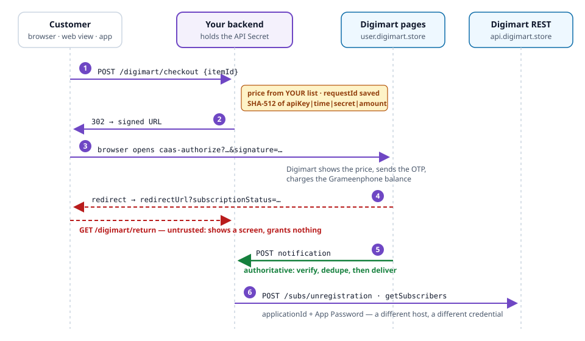

<p align="center">
  
</p>

<h1 align="center">Digimart Skill for Agents</h1>

<p align="center">
  <em>Grameenphone carrier billing your AI agent gets right the first time.</em>
</p>

<p align="center">
  <sub>by <strong>hSenid Mobile Solutions</strong> for <strong>Digimart</strong></sub>
</p>

<p align="center">
  <a href="https://github.com/hSenidMobileCPaaS/Digimart-as-a-skill/actions/workflows/ci.yml"></a>
  <a href="LICENSE"></a>
  
  
  
  
  
  
</p>

<p align="center">
  <strong>Subscription SDK · One-Time Charging SDK (CaaS) · REST subscriber APIs · Notifications</strong><br>
  <sub>Charging Grameenphone subscribers' mobile balance in Bangladesh.</sub>
</p>

---

Ask an AI agent to integrate Digimart today and it will reach for what every other telco platform
taught it: a JSON `POST` to a charging endpoint. **Digimart has no such endpoint.** Charging is a
**signed URL** that your server builds and the customer's browser opens; Digimart runs the number
entry, the OTP and the charge, then sends the browser back and POSTs the result to you.

Then it will sign `apiKey|apiSecret|requestTime` — the order an older tutorial's prose gave — and
get `E1002` on every request, because the secret goes in the **middle**. It will copy a working
subscription to one-time charging and forget that the **amount is signed** there. It will write
Dhaka wall-clock time with a `Z` and land six hours out. It will grant access on the redirect, which
anyone can forge by typing `?subscriptionStatus=S1000`. And, having seen other hSenid platforms, it
will happily call an SMS or OTP endpoint that Digimart's OpenAPI file mentions by name — and never
defines.

None of that is the model being careless. It is the model not having the contract.

This repo gives it the contract: every flow, every parameter, every field, all 31 SDK status codes,
the REST APIs, what Digimart sends back, the endpoints **you** have to build — and a register of
everything Digimart does *not* publish, so nothing gets invented.

**In whatever language you already use.** SHA-512, a query-string encoder and an HTTPS client are
in every standard library:

- [**Every flow, call and callback at the wire**](references/13-integration-reference.md) — each
  signed URL as a shell recipe (POSIX shell + `openssl`), each REST call as a runnable curl, each
  inbound surface with a command that replays it, and every parameter defined.
- [**references/10-any-stack.md**](references/10-any-stack.md) specifies what surrounds them
  language-neutrally — for Ruby, Rust, Kotlin, Elixir, Dart or anything else.
- [**templates/**](templates/README.md) shows the whole thing built in TypeScript/Node, Python,
  Java, Go, PHP and C# — worked examples to read for shape.

---

## Install

Pick your agent. Everything below is the same content behind a different filename.

<details open>
<summary><strong>Claude Code</strong></summary>

```
/plugin marketplace add hSenidMobileCPaaS/Digimart-as-a-skill
```
```
/plugin install digimart@digimart
```

Or clone it as a skill directly:

```bash
git clone https://github.com/hSenidMobileCPaaS/Digimart-as-a-skill ~/.claude/skills/digimart
```
</details>

<details>
<summary><strong>Cursor</strong></summary>

```bash
git clone https://github.com/hSenidMobileCPaaS/Digimart-as-a-skill .digimart
cp .digimart/.cursor/rules/digimart.mdc .cursor/rules/
```
</details>

<details>
<summary><strong>Codex</strong></summary>

```bash
codex plugin marketplace add hSenidMobileCPaaS/Digimart-as-a-skill
codex plugin add digimart@digimart
```
</details>

<details>
<summary><strong>GitHub Copilot</strong></summary>

CLI:

```bash
copilot plugin marketplace add hSenidMobileCPaaS/Digimart-as-a-skill
```

Editor extension — copy the instructions file:

```bash
cp .digimart/.github/copilot-instructions.md .github/
```
</details>

<details>
<summary><strong>Gemini CLI / Antigravity</strong></summary>

```bash
gemini extensions install https://github.com/hSenidMobileCPaaS/Digimart-as-a-skill
```
</details>

<details>
<summary><strong>Windsurf · Cline · Kiro · Qoder</strong></summary>

```bash
git clone https://github.com/hSenidMobileCPaaS/Digimart-as-a-skill .digimart
cp .digimart/.windsurf/rules/digimart.md  .windsurf/rules/     # Windsurf
cp .digimart/.clinerules/digimart.md      .clinerules/         # Cline
cp .digimart/.kiro/steering/digimart.md   .kiro/steering/      # Kiro
cp .digimart/.qoder/rules/digimart.md     .qoder/rules/        # Qoder
```
</details>

<details>
<summary><strong>Aider · Zed · Amp · Jules · Junie · OpenCode · anything reading AGENTS.md</strong></summary>

```bash
git clone https://github.com/hSenidMobileCPaaS/Digimart-as-a-skill .digimart
```

Then reference `.digimart/AGENTS.md` from your own `AGENTS.md`, or copy it to the project root.
</details>

<details>
<summary><strong>No install — any assistant</strong></summary>

Paste the raw URL and ask it to read the file:

```
https://raw.githubusercontent.com/hSenidMobileCPaaS/Digimart-as-a-skill/main/AGENTS.md
```
</details>

Full matrix of what each agent reads: **[docs/agent-support.md](docs/agent-support.md)**.

---

## How Digimart actually works

<p align="center">
  
</p>

| | Charging SDK | REST APIs |
|---|---|---|
| **What** | A **signed URL** the customer's browser opens | JSON **POST** from your server |
| **Host** | `user.digimart.store` | `api.digimart.store` |
| **Credential** | `apiKey` + SHA-512 `signature` made with the **API Secret** | `applicationId` + **App Password** in the body |
| **Covers** | Subscribing (with or without header enrichment), one-time charging | Subscriber list, subscriber charging info, unsubscription |
| **Answer** | A browser redirect (untrusted) and a server notification (authoritative) | `statusCode` in the body |

And the endpoints **you** build: a start endpoint that signs URLs (clients never hold the secret),
a redirect page that grants nothing, two notification receivers that settle orders, a cancel
endpoint, and a reconciliation job. `node tools/digimart.mjs platform` lists them.

---

## The part that makes it precise

The whole Digimart contract also ships as **structured data** —
[`catalog/digimart-api.json`](catalog/digimart-api.json) — with a zero-dependency CLI over it that
any agent can drive through its shell. The capability an MCP server would give you, without running
one.

```bash
$ node tools/digimart.mjs sign --example one-time

  Worked example  One-Time Charging SDK (CaaS)

  Signing string  myApiKey123|2024-08-08T12:00:00Z|mySecretKey456|50
  SHA-512         3badf638ceca499000fd07b899e5fc0cec348d9762886b8430104291126683892845a208caef8e99b53432571e46c5f04162a1a25646443f7935239ea0901b38

  Hash this exact string in your own language. If you do not get this digest,
  your hashing is wrong before Digimart is involved — check UTF-8, SHA-512, lowercase hex.
```

| Command | Answers |
|---|---|
| `list` / `show <id>` / `search "<q>"` | What exists, and exactly what does it take and return? |
| `platform` | Hosts, credentials, the endpoints I must build |
| `gaps` | What Digimart does **not** publish, and where its own docs disagree |
| `sign --example [flow]` | **The known digest** to test my hashing against |
| `url <flow> k=v …` | **A signed authorize URL**, plus the same thing as a shell recipe |
| `check-url '<url>'` | **Is the URL my code built right?** Recomputes the signature and names the mistake |
| `redirect '<url>'` | What did the redirect return mean? |
| `curl <id> k=v …` | A REST call as runnable curl |
| `validate <id> '<json>'` | Is this REST body or notification payload right? |
| `response <id> '<json>'` | What does this REST response mean? |
| `code <CODE>` / `diagnose "<symptom>"` | What went wrong, and the fix |
| `practices` / `checklist` / `reference <doc>` | The rules, the go-live list, the full guides |

Add `--json` to any command. The CLI makes no network calls. `sign`, `url` and `check-url` read
`DIGIMART_API_SECRET` from the environment **if it is set**, to hash locally — they never print it
and refuse it as a command-line argument. Nothing else touches a credential.

It finds the signing mistake for you:

```bash
$ DIGIMART_API_SECRET=… node tools/digimart.mjs check-url 'https://user.digimart.store/sdk/subscription/caas-authorize?…&amount=50'

  ✗ 1 problem(s)  against one-time
    ✗ Signature does not match. The amount was left out of the hash. One-time charges sign
      apiKey|requestTime|apiSecret|amount. Expect E1002.
```

It reads what came back:

```bash
$ node tools/digimart.mjs redirect 'https://shop.example/digimart/return?subscriptionStatus=E3009&subscriberId=…&requestId=…'

  ✗ E3009  Your account balance is too low, recharge and try again
  ! Travelled through the subscriber's browser. Anyone can type this URL. Never fulfil on it.

  Next
    · The single most common real-world failure. Give it its own friendly recharge screen …
```

And it refuses to guess:

```bash
$ node tools/digimart.mjs code E1104

  E1104  undocumented  rest
  Permitted on the Subscriber List response. Digimart publishes no description.
  ! Digimart publishes no meaning for this code. Do not borrow one from another platform.
```

### Every flow and call at the wire — the path for any language

[references/13-integration-reference.md](references/13-integration-reference.md) is generated from
the catalog and CI fails if it drifts:

```bash
# apiKey|requestTime|apiSecret|amount  ->  SHA-512  ->  lowercase hex
SIGNATURE="$(printf '%s' "$DIGIMART_API_KEY|$REQUEST_TIME|$DIGIMART_API_SECRET|$AMOUNT" \
  | openssl dgst -sha512 | awk '{print $NF}')"

URL="$DIGIMART_CAAS_AUTHORIZE_URL?apiKey=$DIGIMART_API_KEY&requestId=$REQUEST_ID&requestTime=$REQUEST_TIME&signature=$SIGNATURE&redirectUrl=$REDIRECT_URL&amount=$AMOUNT"
```

```bash
curl -sS -X POST "$DIGIMART_UNREGISTRATION_URL" \
  -H 'Content-Type: application/json;charset=utf-8' \
  --max-time 15 \
  -d @- <<REQUEST
{
  "applicationId": "$DIGIMART_APP_ID",
  "password": "$DIGIMART_PASSWORD",
  "subscriberId": "tel:NTM3MDgz…",
  "action": "0"
}
REQUEST
```

Credentials come from the environment, so nothing on the page is a secret and nothing you copy can
commit one. There is deliberately **no code generator**: an emitter serves the languages someone
wrote emitters for and ages with their idioms, while a recipe is the same call everywhere.

---

## Coverage

Everything Digimart publishes at <https://digimart.store/docs>, and nothing it does not:

| | Covered | Reference |
|---|---|---|
| **Subscription Charging SDK** | Signed URL on `/sdk/subscription/authorize`; the default flow and the header-enrichment variant; `msisdn` skip; states; the `subscriberId` mapping | [03-subscription-sdk](references/03-subscription-sdk.md) |
| **One-Time Charging SDK (CaaS)** | Signed URL on `/sdk/subscription/caas-authorize`; the signed amount; the 1–600 BDT band; the order state machine | [04-one-time-sdk](references/04-one-time-sdk.md) |
| **Signatures** | SHA-512, the signing strings, known-answer digests, per-language notes, debugging `E1002` | [02-signatures](references/02-signatures.md) |
| **What comes back** | The redirect return, the charging notification, the subscription notification (`/subscription/notify`) | [05-callbacks](references/05-callbacks.md) |
| **REST APIs** | Subscriber List, Subscriber Charging Info, User Unsubscription | [06-rest-apis](references/06-rest-apis.md) |
| **Status codes** | All 31 SDK codes with Digimart's wording; the 9 REST codes, marked undocumented where they are | [07-status-codes](references/07-status-codes.md) |
| **Not published** | SMS, USSD, OTP, balance and direct-debit (tags without paths), server-side charging, refunds, notification signatures, a sandbox host — recorded, never invented | [12-source-discrepancies](references/12-source-discrepancies.md) |
| **Where the docs disagree** | 17 recorded contradictions in Digimart's own sources, each with the reading this skill uses | [12-source-discrepancies](references/12-source-discrepancies.md) |

### Languages

| Stack | What ships |
|---|---|
| TypeScript / Node | config, signer + REST client, Express routes (runs under Node's type stripping) |
| Python | config, signer + REST client (standard library only), FastAPI routes |
| Java | config, signer + REST client (`HttpClient` + Jackson), Spring controller with `@Async` |
| Go | config, signer + REST client, `net/http` handlers (standard library only) |
| PHP | config, signer + REST client (cURL, bcmath), framework-neutral front controller |
| C# / .NET | options, signer + REST client, minimal APIs + `BackgroundService` |
| Anything else | [13-integration-reference](references/13-integration-reference.md) + [10-any-stack](references/10-any-stack.md), with a port acceptance checklist |

### Skills

| Skill | Use it for |
|---|---|
| `digimart` | General Digimart work; the rules and the surface |
| `digimart-scaffold` | Starting a new integration |
| `digimart-callbacks` | The redirect page and both notifications |
| `digimart-review` | Auditing existing code |
| `digimart-debug` | A failing URL, notification or REST call |
| `digimart-golive` | The pre-production checklist |
| `digimart-help` | Quick reference |

On plugin-tier hosts these are also slash commands: `/digimart`, `/digimart-review`, and so on.

---

## What it actually changes

| Mistake | Consequence |
|---|---|
| Treating charging as a REST call | There is no charging endpoint. Nothing works. |
| Signing in the browser or the mobile app | The API Secret ships to every device; anyone can charge your customers. |
| `apiKey\|apiSecret\|requestTime` | `E1002` on every request. The secret goes in the middle. |
| Leaving the amount out of a one-time signature | `E1002` on every one-time charge, while subscriptions keep working. |
| Formatting `requestTime` or `amount` twice | Hash and URL disagree by a millisecond or a `.00` — `E1002`. |
| Dhaka wall-clock time with a `Z` | Six hours out — `E1004`. |
| `requestId` from the millisecond clock | Collides under load — `E1005`. |
| Taking the amount from the client | A user sets their own price, and it is signed. |
| Granting access on the redirect | Anyone can type `?subscriptionStatus=S1000`. |
| One notification receiver | The flows notify different URLs; paying customers get nothing. |
| No cancel path | Fails go-live; a condition of the developer agreement. |
| REST calls with the API Key and a signature | Wrong credential, wrong host. |
| A meaning invented for `E1100`–`E1107` | Wrong handling built on a guess. |
| Calling SMS/OTP/balance endpoints | They do not exist on Digimart. |

---

## Quick start

```bash
# 1. Configure
cp templates/.env.example .env
$EDITOR .env                          # app id, API key/secret, App Password, the endpoints you use

# 2. Prove your hashing
node tools/digimart.mjs sign --example one-time

# 3. Build a real signed URL and open it in a browser
node tools/digimart.mjs url subscription redirectUrl=https://your-app.example/digimart/return

# 4. Check the REST credentials — from the server that will call Digimart
./scripts/smoke-test.sh               # Windows: .\scripts\smoke-test.ps1

# 5. Test your inbound handlers — no Digimart account needed
./scripts/test-callbacks.sh http://localhost:3000
```

Then ask your agent:

> Add Digimart one-time charging to this app: a "Buy 100 credits" button for 50 BDT that credits
> the account only when Digimart confirms the payment.

Starting from nothing, mid-build, or adding Digimart to an app that already has users? The A-to-Z
route for each is [references/11-implementation-playbook.md](references/11-implementation-playbook.md).

---

## What's inside

```
SKILL.md · AGENTS.md              Entry points (Claude Code / everyone else)
catalog/digimart-api.json         The whole contract as structured data, sources and gaps included
tools/digimart.mjs                Offline CLI over the catalog: sign, url, check-url, curl, validate…
references/                       13 guides: getting started, signatures, the two SDKs, callbacks,
                                  REST, status codes, security, go-live, any-stack, the A-to-Z
                                  playbook, what is not published, and every flow and call at the wire
templates/                        .env.example + config, signer, REST client and handlers in
                                  TypeScript/Node, Python, Java, Go, PHP and C#
skills/ · commands/               7 task skills and their slash commands
scripts/                          Smoke tests (bash + PowerShell), inbound tests, rule sync,
                                  integration-reference build
docs/agent-support.md             Which agent reads which file
```

---

## Development

```bash
npm test                                       # catalog, tooling and packaging tests
npm run check                                  # tests + everything generated is in sync
node scripts/sync-rules.mjs                    # regenerate the agent rule copies
node scripts/build-integration-reference.mjs   # regenerate the integration reference
```

Two things are generated and CI fails if they drift: the seven agent rule files, from `AGENTS.md`,
and `references/13-integration-reference.md`, from the catalog. The suite also checks the
worked-example digests, that every sample validates against its own contract, that the templates
agree on variable names and signing, and that no credential-shaped string is committed.

See [CONTRIBUTING.md](CONTRIBUTING.md). Corrections to the contract are the most valuable
contribution — cite the documentation page or paste the observed, redacted response.

---

## Sources

Everything derives from Digimart's published documentation:

- <https://digimart.store/docs> — the developer documentation (the source of truth)
- <https://digimart.store/docs/rest-api> — the REST APIs, transcribed from Digimart's OpenAPI 3.0
  specification
- <https://digimart.store/pricing> — the one-time charging band
- <https://digimart.store/legal/terms> — developer obligations

**Nothing in this repo is invented.** Where Digimart publishes no meaning for a status code, this
skill says so rather than borrowing one. Where its OpenAPI file names operations without defining
them, they are recorded as not published. Where its sources contradict each other, both readings
are recorded with the one this skill uses — see
[12-source-discrepancies](references/12-source-discrepancies.md).

Digimart evolves. Confirm with the platform what your application is enabled for before go-live,
and open an issue if the behaviour moves.

## Support

- **Documentation** — <https://digimart.store/docs>
- **Portal** — <https://user.digimart.store/>
- **Digimart support** — support@digimart.store · +8801764987009

Quote your `requestId`, the `internalTrxId` for a charge, and the status code — that is what a trace
is built from.

## Security

No secrets in this repo; every credential is a placeholder and CI enforces it. The CLI makes no
network calls. See [SECURITY.md](SECURITY.md), and read `scripts/smoke-test.*` before running it —
`--with-unsubscribe` really unsubscribes, and `--print-url` prints URLs that charge real money.

## Licence

**Proprietary.** Copyright © 2026 hSenid Mobile Solutions (Pvt) Ltd. All rights reserved.

This skill is the sole property of hSenid Mobile Solutions and is licensed for **use only**. See
[LICENSE](LICENSE) for the full terms.

| | |
|---|---|
| ✅ You may | Install it into your AI coding assistant and use it, unmodified, to build and operate your own Digimart integrations. The integration code you produce is yours. |
| ❌ You may not | Copy it beyond what installation requires, modify it, publish or redistribute it, mirror or fork it, sublicense it, sell it, or bundle it into anything you sell. |

**Digimart**, **Grameenphone**, **hSenid Mobile** and their logos are trademarks of their respective
owners. You may refer to Digimart by name when describing an integration you have built; you may
not use the marks in your own product, service or marketing.

For any permission beyond this — including modifying, redistributing or embedding the skill —
contact hSenid Mobile Solutions.

---

<p align="center">
  <a href="https://www.hsenidmobile.com">
    
  </a>
</p>

<p align="center">
  <sub>Built by <a href="https://www.hsenidmobile.com">hSenid Mobile Solutions</a> for
  <a href="https://digimart.store">Digimart</a>.</sub><br>
  <sub>The platform evolves — verify anything security- or billing-critical against
  <a href="https://digimart.store/docs">the Digimart documentation</a> before going live.</sub>
</p>
